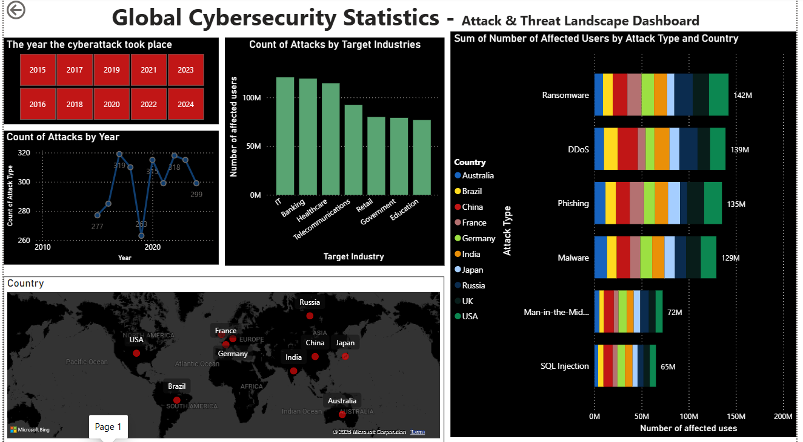
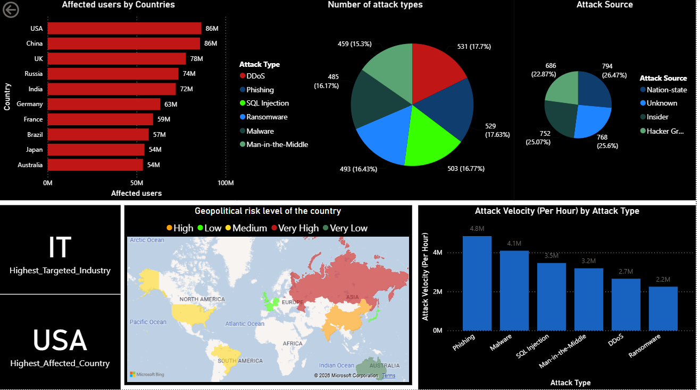

# 🛡️ Global Cybersecurity Statistics & Interactive Power BI Dashboard

Welcome to the **Global Cybersecurity Statistics** project! This repository contains a comprehensive historical dataset of 3,000 cybersecurity incidents spanning from **2015 to 2024** across 10 major nations, coupled with an interactive **Power BI Dashboard (`.pbix`)** designed to analyze trends, assess financial impacts, evaluate defense mechanisms, and uncover critical risk patterns.



---

## 📋 Table of Contents
1. [Project Overview](#-project-overview)
2. [Key Insights & Statistical Findings](#-key-insights--statistical-findings)
3. [Dashboard Structure](#-dashboard-structure)
4. [Dataset & Data Dictionary](#-dataset--data-dictionary)
5. [Getting Started & Usage](#-getting-started--usage)
6. [Key Takeaways for Cybersecurity Strategy](#-key-takeaways-for-cybersecurity-strategy)

---

## 🔍 Project Overview

As cyber threats grow in complexity and frequency, data-driven security intelligence is paramount. This project analyzes **3,000 simulated global cybersecurity incidents** across different target industries (IT, Healthcare, Banking, Retail, Government, Telecom, Education) and regions. 

The accompanying Power BI dashboard translates raw incident logs into actionable executive insights, visualizing:
- **Financial impact** (total and average loss, cost per user).
- **Incident response efficiency** (resolution time vs. severity).
- **Vulnerability vectors** (zero-day exploits, social engineering, weak passwords, unpatched software).
- **Attack origins & profiles** (nation-states, hacker groups, insider threats).

---

## 📈 Key Insights & Statistical Findings

A statistical deep dive of the `Global Cybersecurity Statistics.csv` dataset reveals critical benchmarks:

### 💰 Financial & User Impact
* **Total Global Loss:** **$236,270.47 Million** ($236.27 Billion USD) over 10 years.
* **Average Loss per Incident:** **$78.76 Million**.
* **Total Affected Users:** **683.33 Million** users globally.
* **Average Incident Resolution Time:** **42.73 Hours**.

### 🏥 Industry Financial Loss (Top to Bottom)
1. **Healthcare:** **$50,227.30 Million** (Most financially devastated sector)
2. **Banking:** **$47,322.45 Million**
3. **IT:** **$36,293.22 Million**
4. **Telecommunications:** **$32,272.11 Million**
5. **Government:** **$28,937.05 Million**
6. **Education:** **$22,385.95 Million**
7. **Retail:** **$18,832.39 Million**

### ⚔️ Attack Types & Cost Dynamics
* **Ransomware** and **DDoS** are the primary drivers of financial devastation, accounting for over half of the total losses:
  * **Ransomware:** **$63,518.57 Million**
  * **DDoS:** **$59,693.18 Million**
  * **Malware:** **$38,181.66 Million**
  * **Phishing:** **$33,363.03 Million**
  * **Man-in-the-Middle:** **$21,462.21 Million**
  * **SQL Injection:** **$20,051.82 Million**

### 🌎 Geographic & Geopolitical Profile
* **UK** suffered the highest total financial damage ($26,136.70M), followed closely by **Russia** ($24,822.43M), **India** ($24,414.22M), and **France** ($24,371.11M).
* **Nation-state actors** are the single largest source of attacks (794 incidents), followed by **unknown origins** (768) and **insider threats** (752).

---

## 📊 Dashboard Structure

The Power BI workbook (`Visualization group project (1).pbix`) features several analytical views:

### 1. Executive Summary Page
* **KPI Cards:** Displaying Total Financial Loss, Total Affected Users, Average Resolution Time, and Overall Incident Counts.
* **Geographic Map:** Highlighting loss hotspots and regional distribution of incidents.
* **Trend Analysis:** Showing the rise/fall of incidents and losses over the 2015-2024 timeline.

### 2. Attack Vectors & Vulnerability View
* **Donut Chart:** Comparing attack types (DDoS vs Ransomware vs SQL Injection etc.).
* **Matrix/Heatmap:** Showing vulnerabilities (Zero-day, Unpatched Software, Weak Passwords) cross-referenced against the targeted industries.
* **Complexity analysis:** Breakdown of overall complexity scores against attack velocity.

### 3. Defense & Security Performance
* **Bar Charts:** Evaluating the effectiveness of different defense mechanisms (AI-based Detection, Firewall, Encryption, VPN, Antivirus) based on average incident resolution time and financial loss mitigation.
* **Source Attribution:** Interactive breakdown showing threat actor types (Hacker Groups vs Nation-State vs Insider) across various regions.

---

## 📂 Dataset & Data Dictionary

The underlying dataset contains the following attributes for each of the 3,000 recorded incidents:

| Column Name | Description | Example Value |
| :--- | :--- | :--- |
| **Country** | Nation where the incident occurred | `Australia` |
| **Year** | The year of the incident (2015-2024) | `2016` |
| **Attack Type** | Method of cyberattack | `Malware`, `Phishing`, `DDoS` |
| **Target Industry** | Targeted economic sector | `Telecommunications`, `Healthcare` |
| **Attack Source** | Attributed threat actor profile | `Insider`, `Nation-state`, `Hacker Group` |
| **Security Vulnerability Type** | Flaw exploited to compromise systems | `Zero-day`, `Social Engineering` |
| **Defense Mechanism Used** | Primary defense technology in place during attack | `Firewall`, `Encryption`, `AI-based Detection` |
| **Financial Loss (in Million $)** | Total monetary damage from the breach | `45.9` |
| **Incident Resolution Time (in Hours)** | Hours elapsed from detection to containment | `12` |
| **Number of Affected Users** | Estimated user records compromised or impacted | `83323` |
| **Region** | Geographic continent/region | `Oceania`, `Western Europe` |
| **Incident Cost Per User ($)** | Calculated cost divided by affected users | `550.87` |
| **Attack Velocity (Per Hour)** | Speed/rate of the attack spread | `83323` |
| **Overal Severity Score** | Aggregated severity rating of the incident | `2` |
| **Overall Complexity Score** | Aggregated technical complexity rating | `3` |
| **Geopolitical Risk Score** | Country-specific threat level score | `1` |

---

## 🚀 Getting Started & Usage

To view and interact with the Power BI dashboard:

### Prerequisites
1. Download and install [Power BI Desktop](https://powerbi.microsoft.com/desktop/) (free).
2. Clone this repository to your local machine:
   ```bash
   git clone https://github.com/venurikinara2002-lang/Global-Cybersecurity-Statistics-PowerBI.git
   ```

### Opening the Project
1. Open Power BI Desktop.
2. Click **File -> Open report** and navigate to the cloned folder.
3. Select `Visualization group project (1).pbix`.
4. If Power BI prompts for a data source update (since the local file path of the CSV might change), go to **Transform Data -> Data source settings**, select the `Global Cybersecurity Statistics.csv` file, and update it to match the path on your local system.
5. Click **Apply Changes** to refresh the visual reports.

---

## 🛡️ Key Takeaways for Cybersecurity Strategy

1. **Healthcare Needs Immediate Security Hardening:** Despite not being the most targeted industry by volume (IT is first), Healthcare suffered the highest financial losses ($50.2B). This indicates low operational resilience and high costs associated with medical record data breaches.
2. **Zero-Day and Social Engineering Lead:** Zero-days (785) and Social Engineering (747) remain the most leveraged entry points. This highlights the need for continuous penetration testing, regular threat hunts, and ongoing user awareness training.
3. **Focus on Ransomware & DDoS Prevention:** Preventing Ransomware and DDoS attacks should be prioritized, as they account for over **52% ($123.2 Billion)** of all global financial losses.
4. **Insider Threats are Real:** With 752 incidents classified as "Insider" threats, organizations must focus on robust Identity and Access Management (IAM), Least Privilege access, and behavioral analytics.